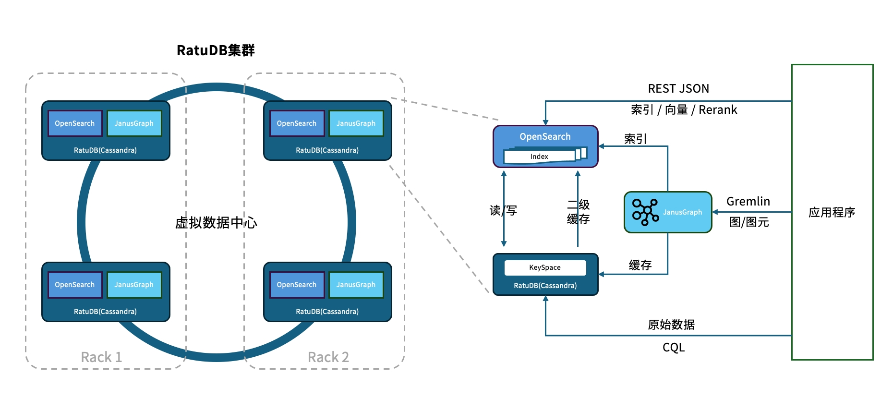
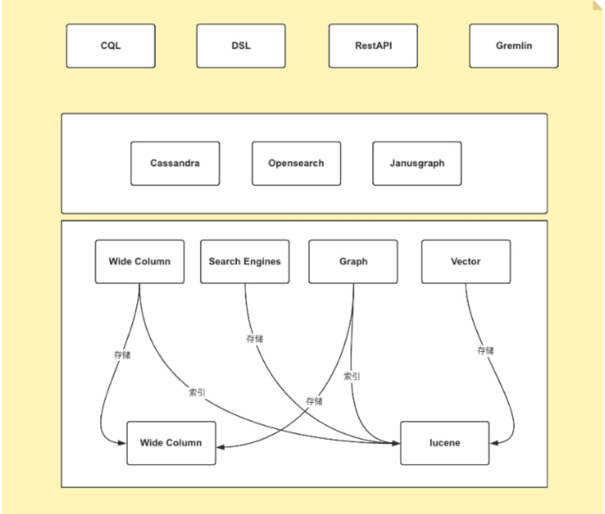
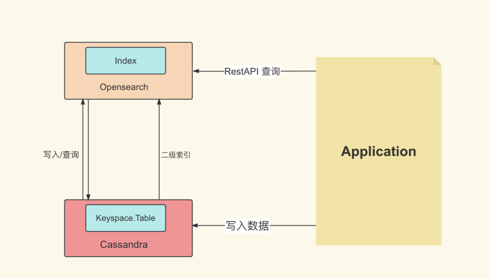
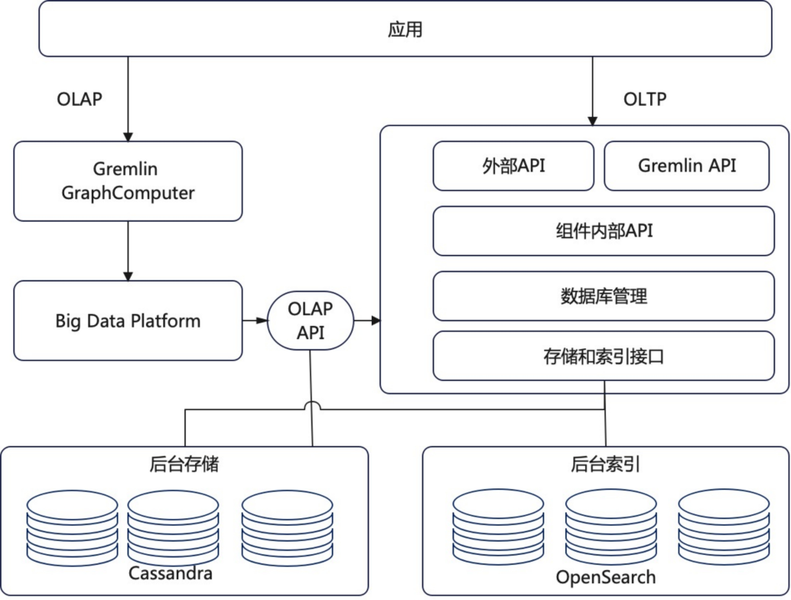
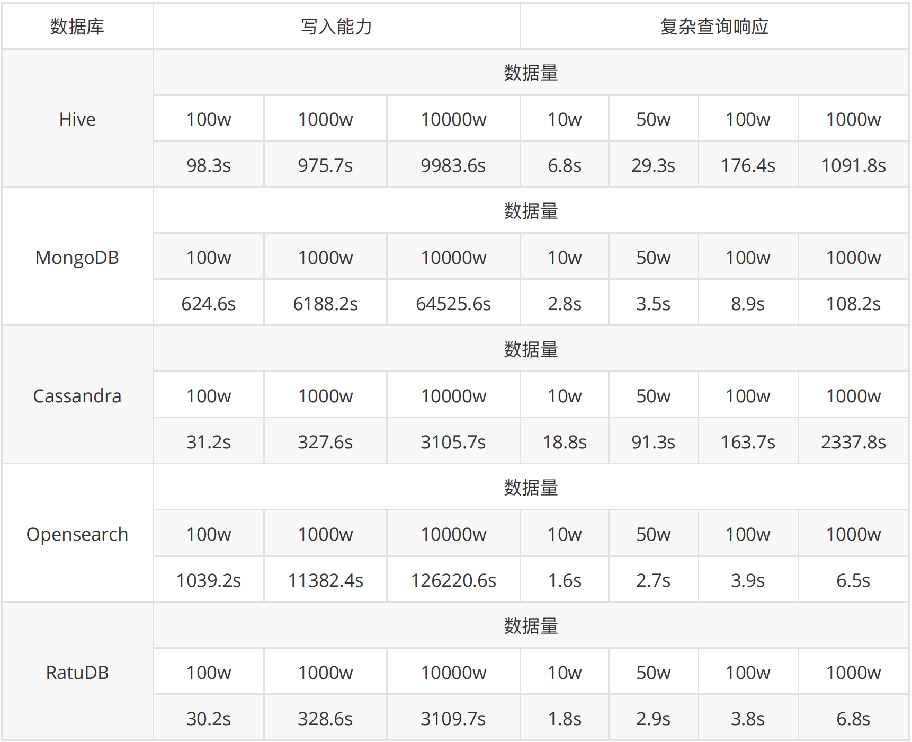

#  RatuDB

#### 1、Ratudb简介

RatuDB 是中科睿途基于Cassandra之上研发的新⼀代去中⼼化、分布式分析数据库系统，拥有全⽂索引实时复杂聚合的能⼒，⼜拥有⾼速读取与写⼊的能⼒，即对海量数据存储能⼒⼜具备⾼扩展的效果，还可以⽀持图数据的存储与索引。数据库专为⼤规模数据集设计，能够处理和存储PB级别数据，满⾜⼤数据和⼤模型时代复杂的需求。系统采⽤⼀体化架构设计模式，兼顾分布式架构的扩展性与集中式架构的性能优势，具备⾼扩展、⾼可⽤、稳定可靠等特征。系统⽀持结构化数据库、⾮结构化数据库、索引数据库、图数据库以及向量数据库等存储模式。通过优化 Cassandra 的快速写⼊能⼒和 OpenSearch 的⾼效检索能⼒，实现了⾼性能的数据读写，即使在海量数据处理情况下也能保持优异的性能表现。

##### 1.1、 为什么做

当前市面的数据仓库驳杂繁多，各自拥有自己的风格和特点，同样也存在一些问题。面向大数据场景下的数据分析项目，Hadoop存在学习成本高、管理难度大的情况；Cassandra使用中出现索引的简单化，在精准化查询的需求下，很难满足大数据场景下的查询需求。

为了解决这些问题，中科睿途研发了自己的数仓产品RatuDB，已经在线运行超过一年时间，累计存储数据量超过200亿，日均增量超过4000万条。

RatuDB在大规模数据存储和分析的方向上能够做到线性扩展；能够支持处理高并发和高吞吐量的数据访问；同时具备实时搜索、推荐的能力；在处理大规模数据收集、存储和分析的领域有着独到的优势；

##### 1.2、 RatuDB架构及能力

RatuDB采用无主架构，最终一致性的原则，具有良好的可扩展性，可以方便地添加新的节点和扩展集群规模，其构成分为持久化组件，索引组件，和图数据组件三个部分；

如图：



从逻辑结构上来讲，RatuDB只有三层实现，应用层、数据库模型和存储层， 存储应用了两种存储形式，只有文件系统存储和lucene。而文件系统数据，就存储了Wide Column数据库模型的大量数据，lucene作为索引更好的将两种数据结合使用。

如图：




以下分别介绍持久化，索引，图数据组件：

###### **持久化组件**

RatuDB的读写操作是通过分布式架构和一致性哈希算法实现的。在写入操作中，数据首先被写入到内存中的MemTable，当MemTable的大小达到一定阈值时，数据会被刷新到磁盘上的SSTable文件中。读取操作则会从MemTable和SSTable中合并数据，以提供给用户。

RatuDB拥有多种一致性级别，允许开发者在数据一致性和可用性之间做出权衡。一致性级别定义了在读写操作中要求多少个节点响应才被认为是成功。较低的一致性级别可以提高性能，但会牺牲一些数据的一致性。较高的一致性级别可以提高数据的一致性，但可能会影响性能。

RatuDB的分布式特性主要体现在数据分片和复制上。数据分片通过一致性哈希算法实现，将数据分散存储在多个节点上，实现水平扩展。复制则通过多副本备份策略，将数据复制到多个节点上，当某个节点发生故障时，其他节点可以接管其工作，保证系统继续运行。RatuDB的分布式架构支持动态扩展和自动负载均衡，使得它能够适应不断变化的数据和流量需求。

RatuDB采用Cassandra作为自己的数据持久化组件；Cassandra 是一种高性能分布式NoSQL数据库，可以管理分布在许多服务器上的大量数据，同时保持高可用性。拥有提供出色的容错性，读写性能卓越，高扩展，简单易用的特点。

然而Cassandra在实际生产使用中，对数据模型设计有着一定的要求，对复杂查询与范围检索支持能力较差，在精准化查询的需求中很难满足，如果进行庞大的分析查询功能将无法满足。

对此情形RatuDB引入了索引机制强化在分析查询领域的能力。

###### **搜索引擎的引入**

RatuDB在实时检索和报表聚合领域能力依然强悍。RatuDB选择OpenSearch作为索引数据库；Opensearch是一个开源的搜索和分析套件。RatuDB就拥有了强大的查询能力，支持复杂的查询语句和聚合操作、支持多种数据处理功能，包括实时数据导入、格式转换、数据解析和索引构建等能力。还提供了数据湖支持，使得用户可以更方便地处理和分析大量的非结构化数据。

Cassandra作为宽表存储，写入性能强悍，但在复杂查询与数据聚合等方面却稍显不足；RatuDB采用把索引存入OpenSearch，可结合各自特点，提高查询效率。复制到OpenSearch中的索引也起到备份作用，且可以充分利用OpenSearch的聚合分析能力，进行数据分析操作。

引入二级索引改进配置和工程化。Cassandra使用二级索引，在原生开源环境下，需要大量配置工作，在运维过程中需要相当专业的经验和知识储备。 RatuDB针对这一问题，将配置服务进行整合，以尽可能少的配置驱动运行服务，且不会影响原生系统的性能和扩展能力。当RatuDB二级索引建立后，会同步给OpenSearch中创建索引，并同步数据。在查询时，可以向OpenSearch发起查询，而OpenSearch作为二级的索引，可以准实时将索引结果反馈给用户。




针对Opensearch的同步或者异步的写入和查询，无法匹配Cassandra的写入性能，并且在应用过程当中存在机器资源内存占用十分恐怖的现象，这使得机器成本大大增加。在数据持续写入成了一个很困难的问题，持续的异步写入，会多次让Opensearch服务崩溃掉(JVM堆溢出)，但是同步的写入也会持续相当长的时间。这些问题与现象是无法接受的。

Ratudb针对Opensearch的写入性能与内存不合理占用的情况，做了大量的优化，使得数据写入存储性能提升，从而搭配Cassandra的特点，让系统能够支持高效写入的状态同时保持优秀的复杂查询能力。又针对Opensearch内存不合理占用的情况，优化内存分配合理使用，降低机器使用资源。


###### **RatuDB对图数据的支持**

RatuDB的图数据库是在JanusGraph基础上做的优化。JanusGraph是一个图形数据库引擎，其本身专注于图形序列化，图形建模、查询执行等基本功能，支持多节点分布式图实时遍历和分析查询。 RatuDB图数据库组件，后台数据存储选择的是Cassandra，索引是采用OpenSearch。

JanusGraph本身的配置与环境搭建较为繁杂，RatuBD中对此作了大量的简化使得应用的使用门槛进一步降低，在应用中只需一个服务的运行便可以使用图数据库的全部能力。让一个应用即可满足索引与存储的一体化的效果。为运维与基层使用承成员减少大量配置维护成本。





##### 1.3、 RatuDB的优势与特点

RatuDB拥有以下特点：

· 无中心分布式架构；RatuDB采用无中心的分布式架构理念；可以通过分布式架构和数据复制来实现⾼可⽤性，因此更加抗攻击。数据就近存储和处理在⽆中⼼数据库系统中，降低了数据传输的延迟，提⾼系统的响应速度。根据系统的负载和变化来⾃动调整数据的分布和处理⽅式，以适应不同的⼯作负载和需求。可以很容易地向系统中添加新的节点，以实现系统的扩展和提⾼性能。

· 支持多数据库模型；从设计之初，RatuDB思考的就是如果能够增加自己本身支持的数据库模型，不是单纯的在一种存储形式上去增加其他数据库模型的视线，而是在真正的Wide Column这种数据库模型的基础上，去提升它本身从硬盘上提取数据IO弊端。而Search Engines模型的结合进而补充了这一点。然后在这基础上增加了Graph和Vector两种数据库模型。

· 向量检索；RatuDB在向量检索场景，支持毫秒级查询和秒级更新，适用于不同企业和业务的问答场景向量结果返回；向量检索与大模型结合，可以将企业数据和对话交互信息进行向量特征提取，然后存入向量检索引擎构建索引并进行相似度召回。

· 高性能的搜索分析；依托于Opensearch和Apache Lucene的底层技术实现，可以很容易的在RatuDB内部实现提取、保护、搜索、聚合、查看以以及分析数据。

· 分布式线性扩展； 一个有效的RatuDB集群，在扩展的时候，会在整体集群环形节点上新增一个节点。

· 高性能；可以提供出色的查询性能和处理能力，能够在短时间内处理大量数据。

· 强大的分析能力；提供丰富的分析功能，包括数据可视化、预测分析等。

· 一站式数据仓建设：从数仓建设体系来看，选择RatuDB的学习和使用成本最低，CQL作为类似SQL的存在形式，及易上手。只需要熟悉常用的DSL语法即可。并且RatuDB本身对硬件的要求不是很高，在实际的开发测试过程中，千万级别的数据，使用普通的服务器进行写入存储和查询即可实现。随着业务量增加，不断向集群增加服务器节点即可。

· 为AI赋能： Vector数据库模型的支持，为图像检索、音频检索、文本检索等领域提供了高效的存储和检索大规模的向量数据，以满足AI在向量数据各种场景下的业务需要。

在选择数据仓库技术时，需要综合考虑多个关键因素，以确保选型能够满足业务需求并提供高效、可靠的数据支持。


##### 1.4、 性能比对




测试结果显示，RatuDB的读写能力与查询响应能力和同类数据库相比，性能优势明显。

##### 1.5、 总结

随着大数据产业的广泛应用，数据的爆炸式增长对数据库系统的性能和扩展性提出了极高的要求。现有的数据库系统在处理高并发写入、高性能查询和复杂图数据分析方面各有优势，RatuDB旨在创建一个去中心化的一体化的分析数据库系统，整合各开源项目优势，实现高速写入、高性能索引、分布式处理及复杂图数据分析的能力。

RatuDB应用范围覆盖场景极为广泛，在当前市场大数据、AI产品林立的阶段，能够覆盖大部分的使用场景；在AI领域可以提供长久的数据记忆；在数据大模型的方向还可以提供高效、安全和经济的数据管理解决方案；在大数据领域也能够提供性能卓越的持久化与数据出湖能力；在数据挖掘和业务智能方向上拥有出色的表现。
⽬前该数据库系统已经在出⾏、教育、能源、政务等多个领域助⼒100+客户实现了核⼼业务系统的构建和升级。


## 2、Getting Started

#### 2.1、Requirements

- JDK 11
- Python 3.8 ~ 3.11 (CQL客户端需要)

#### 2.2 Installation

- [下载] 并且 解压 RatuDB 安装包.
- 运行 `bin/ratudb_server` 在 Linux 或者 macOS.
- 运行 `curl -X GET http://localhost:9200/` 验证 Opensearch 是否运行.
- 运行 `./bin/ratudb_client`，默认不填写`ip`地址的情况下，就是连接`127.0.0.1`，可以验证Cassandra是否运行。
- 也可以使用`./bin/nodetool` 客户端工具，查看集群变化，RatuDB默认开放 7199 端口，用于查看集群状态。
- 运行 `./bin/ratudb_client --graph` 就是连接到Janusgraph。

#### 2.3、构建源码

RatuDB 使用 [Gradle](https://gradle.org/) 构建系统.

Gradle 使用 `8.4` 版本，不建议升级 Gradle版本。

同时也需要安装 ant 1.10 。

完成的发行版将输出到 `distributions/archives` 目录.

##### 2.3.1、Fork并且克隆代码

拉取源代码，这样只是将RatuDB的代码拉取下来了，没有子项目Cassandra的代码。

```
git clone https://github.com/Ratu-Tech/RatuDB.git
```

项目里，Cassandra的源码作为项目的 `submodule` 所以拉取的时候需要递归拉取，可以执行下边的命令拉取代码：

```
git clone https://github.com/Ratu-Tech/RatuDB.git --recursive
```

第一次拉取完成之后，cassandra 的源码作为子模块，也需要初始化，安装好ant 1.10以上版本 之后，可以进入源码 **server/cassandra** 目录，然后执行：

```
ant mvn-instal
```

这样就会对所有的cassandra 需要的jar包进行初始化。 当然JDK11要提前安装好。

之后，就可以执行一下运行：

```
./gradlew run
```

如果配置了JDK11, 就可以运行RatuDB，就会拉取一下相关依赖的包，当然也可以直接在IDEA里边打开做同步。

##### 2.3.2、JDK

本机开发的时候，需要配置两个JDK，

```
export RUNTIME_JAVA_HOME="JDK14路径"
export JAVA_HOME="JDK11路径"
```

RUNTIME_JAVA_HOME 是ES 的运行时JDK。

##### 2.3.3、构建

本身项目里，是导入了Cassandra的所有ant任务，而RatuDB启动后自动加载，Cassandra的api包。

所以在架构项目之前，建议先执行，Cassandra的api包的构建任务，当然，如果没有修改Cassandra，也可以直接使用，源码自带了一个成品包。

构建Cassandra的API的jar包：

```
./gradlew cassandra-mvn-install
```

这样就更新了Cassandra 的api包。

构建全平台包：

```
./gradlew assemble
```

这个命令不推荐使用，原因有两点：第一，需要连接Docker，如果Docker服务没启动，构建任务会产生失败。 再有就是很慢，所以还是构建需要的平台版本，比较好，可以执行如下命令：

###### 2.3.3.1、构建linux版本

```
./gradlew :distribution:archives:linux-tar:assemble
```

###### 2.3.3.2、构建mac版本

```
./gradlew :distribution:archives:darwin-tar:assemble
```

###### 2.3.3.3、构建windows版本

```
./gradlew :distribution:archives:windows-zip:assemble
```

这是指定了平台版本，如果想构建本机系统版本，还有一个命令，也可以使用：

```
./gradlew localDistro
```

#### 3、导入项目到 IntelliJ IDEA

RatuDB 使用JDK11,全局配置JDK11就可以了。

- 选择 **File > Open**
- 在随后的对话框中导航到根目录 `build.gradle` 文件
- 在随后的对话框中选择 **Open as Project**

#### 4、高级索引的使用

##### 4.1、创建表

首先，两个服务启动成功后，登录Cassandra：

```
$ ./bin/cqlsh
Connected to Test Cluster at 127.0.0.1:9042
[cqlsh 6.1.0 | Cassandra 4.1.3-SNAPSHOT | CQL spec 3.4.6 | Native protocol v5]
Use HELP for help.
cqlsh>
```

然后可以创建一个keyspaces:

```
CREATE KEYSPACE lei
WITH REPLICATION = {'class': 'SimpleStrategy', 'replication_factor': 1};
```

然后再创建一张表:

```
CREATE TABLE lei.tweets (
   id INT PRIMARY KEY,
   user TEXT,
   body TEXT,
   time TIMESTAMP,
   latitude FLOAT,
   longitude FLOAT
);
```

##### 4.2、创建索引

接下来的创建的索引，举例如下：

```
CREATE CUSTOM INDEX tweets_index ON lei.tweets ()
USING 'org.apache.ratu.second.ElasticSecondaryIndex'
WITH OPTIONS = {
   'refresh_seconds': '1',
   'async_write': 'true',
   'schema': '{
      fields: {
         id: {type: "integer"},
         user: {type: "text"},
         body: {type: "text", analyzer: "english"},
         time: {type: "date", pattern: "yyyy-MM-dd"},
         latitude: {type: "float"},
         longitude: {type:"float"}
      }
   }'
};
```

这是一个全字段索引的例子，当然也可以根据自己的需要进行索引配置。

接下来拆解这些内容：

`CREATE CUSTOM INDEX tweets_index ON lei.tweets ()` 这句的意思就是创建一个自定义索引，名字叫 `tweets_index` 在 `lei.tweets` 这张表上。

`USING 'org.apache.ratu.second.ElasticSecondaryIndex'` 这句就是引用了二级索引的操作类。

`WITH OPTIONS` 就是二级索引的参数。参数里 `refresh_seconds` 就是 Opensearch 的索引刷新频率，如果数据写入频繁，这个值不建议设置过大，索引数据写入ES之后，还是要刷新，才会在ES中查询到，这个刷新频率就是靠这个参数控制的。数据写入频繁，刷新过快，会导致ES内存占用过大，导致内存溢出。默认值是`-1`。 如果未设置的情况，如果在Opensearch中可见，需要手动刷新，执行如下api：

```
POST 索引名/_refresh
```

`schema` 里的 `fields` 就是配置写入 Opensearch 的字段，举个例子：

`body: {type: "text", analyzer: "english"},` 这里边 `type` 就是类型，`analyzer` 就是分词器。

`time: {type: "date", pattern: "yyyy-MM-dd"},` 这里边的 `pattern` 就是日期格式。

并且，如果设置 `text` 也会对应创建子字段。

以上都执行完成后，可以执行在Opensearch里看到索引已经创建了：

##### 4.3、写入数据

再写入几条数据试试,

```
INSERT INTO lei.tweets (id, user, body, time,latitude,longitude) VALUES (1, 'fu', 'abc', '2015-05-15',41.12,-71.34);

INSERT INTO lei.tweets (id, user, body, time,latitude,longitude) VALUES (2, 'fu', '123456', '2019-05-15',41.12,-71.34);

INSERT INTO lei.tweets (id, user, body, time,latitude,longitude) VALUES (3, 'lei', '123456', '2019-05-15',41.12,-71.34);
```

##### 4.4、查询

既然写入索引变化了，所以在Cassandra中查询数据，也需要一个新的表达式，才能进行二级索引的使用：

```
<!--range查询-->
SELECT * FROM lei.tweets WHERE expr(tweets_index, '{
   query: {type: "range", field: "time", gte: "2014-04-25", lte: "2015-05-21"}
}');
query:代表的就是普通查询
type:代表的就是DSL的查询函数
field: 代表的是要查询的字段
gte:  大于等于
lte:  小于等于
<!--match查询-->
SELECT * FROM lei.tweets WHERE expr(tweets_index, '{
   query: {type: "match", field: "user", query: "lei"}
}');
<!--match查询, value形式-->
SELECT * FROM lei.tweets WHERE expr(tweets_index, '{
   query: {type: "match", field: "user", value: "lei"}
}');
<!--match_phrase查询-->
SELECT * FROM lei.tweets WHERE expr(tweets_index, '{
   query: {type: "match_phrase", field: "user", query: "lei"}
}');
<!--match_phrase查询, value形式-->
SELECT * FROM lei.tweets WHERE expr(tweets_index, '{
   query: {type: "match_phrase", field: "user", value: "lei"}
}');
<!--term查询 -->
SELECT * FROM lei.tweets WHERE expr(tweets_index, '{
   query: {type: "term", field: "user", value: "lei"}
}');
```

这个查询与其他的查询的区别是多了 `refresh: true` ，这是将索引写入ES 之后，对ES里的数据进行强制刷新。如果数据写入频率不高，可以使用，频率过快，还多。不建议使用。

```
<!--强制刷新后，range查询-->
SELECT * FROM lei.tweets WHERE expr(tweets_index, '{
   query: {type: "range", field: "time", gte: "2014-04-25", lte: "2015-05-21"},
   refresh: true
}') limit 100;
```

##### 4.5、 Cassandra 与 Opensearch 数据类型对应关系

在创建索引的时候，可以参考这张表

| CQL 类型  | 对应Java类型      | ES类型  | 描述                                                         |
| --------- | ----------------- | ------- | ------------------------------------------------------------ |
| ascii     | String            | text    | asii字符串                                                   |
| bigint    | long              | long    | 64位整数                                                     |
| blob      | ByteBuffer/byte[] | text    | 二进制数组 存入ES后，继续解析回成字符串存储                  |
| boolean   | Boolean           | boolean | 布尔                                                         |
| decimal   | BigDecimal        | float   | 高精度小数                                                   |
| double    | double            | double  | 64位浮点小数                                                 |
| float     | float             | float   | 32位浮点数                                                   |
| inet      | String            | ip      | ipv4或ipv6协议的ip地址(ipv6 暂时没测试)                      |
| int       | int               | integer | 32位浮点数                                                   |
| text      | String            | text    | utf-8编码的字符串                                            |
| timestamp | Date              | date    | 日期 Opensearch 支持的日期，yyyy-MM-dd 或者 yyyy-MM-ddTHH:MM:SSZ ,代码内自动转换 |
| uuid      | UUID              | text    | UUID类型                                                     |
| timeuuid  | UUID              | text    | 时间相关的UUID                                               |
| varchar   | string            | text    | text的别名                                                   |
| varint    | BigInteger        | text    | 高精度整型                                                   |
| duration  | String            | text    | 以纳秒为单位的持续时间                                       |
| smallint  | Integer           | integer | 16位浮点数                                                   |
| tinyint   | Integer           | integer | 8位浮点数                                                    |
| list      | String            | text    | 存入到ES之后是array                                          |
| time      | long              | long    | 纳秒级别的时间戳，格式 hh:mm:ss 的纳秒精准度，存入ES是64位整数 |
| set       | Set               | text    | 存入到ES之后是array                                          |
| map<T,T>  | Map<T,T>          | nested  | 复合结构，支持子查询                                         |

#### 5、janusgraph 配置

##### 修改配置文件。

**janusgraph-cql-opensearch.properties**

这是新建图时候服务存储的核心配置文件了，这里边有几个配置重点讲一下。

------

storage.hostname=127.0.0.1 --- 这是存储的配置，默认启动是127.0.0.1。如果集群模式下，可以把集群内所有IP的地址填写上即可，用逗号分隔开，举例：storage.hostname=192.168.184.31，192.168.184.32，192.168.184.33

------

storage.cql.keyspace=ratudb --- 这是图数据存储到Cassandra里边之后的keyspace名字，现在默认是ratudb，可以根据情况调整。

------

storage.cql.local-datacenter=datacenter1 --- 这是数据中心名称配置，这个在不复杂的网络环境里，建议和cassandra一致即可。默认datacenter1也是cassandra的默认配置。

重点讲一下索引到opensearch的三个配置：

```
index.[X].backend=opensearch
index.[X].hostname=127.0.0.1
index.[X].index-name=sanguosha
```

三个配置，第一个是索引指向opensearch，默认值即可。第二个索引存储的地址，如果集群模式下，可以把集群内所有IP的地址填写上即可，用逗号分隔开，举例：index.[X].hostname=192.168.184.31，192.168.184.32，192.168.184.33。第三个是索引别名，就是配置索引存储的索引名字。

重点说这个X，X位置默认是search，这时候，创建的索引名前缀是janusgraph。如果想修改掉，需要讲X修改为指定名字。并且三项要在同时的配置时候一致。再强调一遍，X位置的配置一定要一致。

#### 6、客户端使用

ratudb_client 是RatuDB的客户端工具。

##### 6.1、连接janusgraph，执行下面命令：

```
./bin/ratudb_client --graph
```

##### 6.2、连接Cassandra，执行下面命令：

```
./bin/ratudb_client 192.168.184.33
```

##### 6.3、新建图

```
graph = JanusGraphFactory.open('../config/janusgraph-cql-opensearch.properties');
```

janusgraph-cql-opensearch.properties 图的配置，配置信息如上面。一定注意路径，必须是*../config/janusgraph-cql-opensearch.properties*。

## 7、集群配置

**举例：**

##### 7.1、我准备了三个linux的虚拟机，分别为

```
192.168.184.31
192.168.184.32
192.168.184.33
```

**JDK 只需要配置11 就可以了，linux环境不建议使用内置jdk，内置jdk使用的是 adoptopenjdk ，内置的是15的版本，但是Cassandra大量使用了反射，而这款jdk在测试过程中反射问题不少。所以linux环境不建议使用。**

环境变量需要配置在`/etc/profile`里边，如下内容：

```
export JAVA_HOME=/home/elastic/jdk-11
export PATH=$JAVA_HOME/bin:$PATH
export CLASSPATH=.:$JAVA_HOME/lib/dt.jar:$JAVA_HOME/lib/tools.jar
```

##### 7.2、先打包liunx版本的发行包

执行：

```
./gradlew :distribution:archives:linux-tar:assemble
```

##### 7.3、将RatuDB的压缩包上传到三台机器里并解压

##### 7.4、接下来修改配置

RatuDB 现在只需要修改 `config` 目录下的 `cassandra.yaml`

需要配置的内容：

```
cluster_name: 'Ratu Cluster'
```

集群名字，这项配置，需要集群内所有机器都是相同的才可以。但是Cassandra有个特点，如果想要修改这个集群名字，需要在Cassandra基础元数据表里先进行修改，然后再修改配置。具体可以参考网上给的配置。所以最终结论就是，当配置好后，正常启动服务了，就不要修改这项值。

```
rpc_address: 192.168.184.31
```

通信地址，这个值配置上之后，es服务的`network.host` 也使用的是这个值。

```
listen_address: 192.168.184.31
```

监听地址。

```
- seeds: "192.168.184.31:7000,192.168.184.32:7000,192.168.184.33:7000"
```

集群节点配置。ES的 `discovery.seed_hosts` 和 `cluster.initial_master_nodes` 也使用这个配置，但是 `http.port` 和 `transport.port` 就没有灵活配置了，就是默认的 `9200` 和 `9300` 。

##### 7.5、数据中心和机架配置

还有一个配置在 `cassandra-rackdc.properties` 文件，这里边就配置了两个值：

```
dc=dc1
rack=rack1
```

`dc` 代表数据中心，`rack` 代表的是机架。 这两个值，对应Opensearch就是自定义属性，配置好就是这个样子：

这个值，预设过来，可以做冷热集群使用。

##### 7.6、修改数据存储目录

在cassandra.yaml文件内，通过更改`data_file_directories` 可以更改cassandra和es的存储路径，如果没有配置的情况下，默认存储在当前程序目录下的`data`目录下。

##### 7.7、启动集群

分别在三个节点启动服务,执行`./bin/ratudb_server`,如果想要用守护进程启动，可以加`-d`参数
