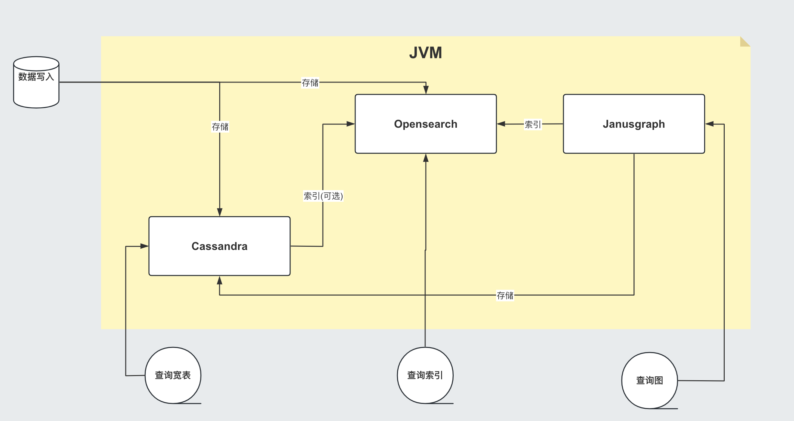

# RatuDB

​	RatuDB是中科睿途以OpenSearch为基础，内置了Cassandra和Janusgraph，可独立运营的无中心分布式分析数据库。以Lucene作为统一存储底层，Cassandra作为数仓单元，可以快速写入，并可以存储数百TB的数据，而不牺牲读取效率；OpenSearch作为数据索引单元，可以更快速地提取、搜索、聚合、查看以及分析数据，JanusGraph作为图关系存储单元，其对数据持久性、数据索引、客户端访问实现了强大的模块化接口，专注于紧凑图、丰富图数据建模、高效的查询执行，能够提供关系型数据、索引型数据、图数据以及向量型数据一体化存储。




## Getting Started

### Requirements

* JDK 11
* Python 3.8 ~ 3.11 (CQL客户端需要)

### Installation

- [下载] 并且 解压 RatuDB 安装包.
- 运行 `bin/ratudb_server` 在 Linux 或者 macOS.
- 运行 `curl -X GET http://localhost:9200/` 验证 Opensearch 是否运行.
- 运行 `./bin/ratudb_client`，默认不填写`ip`地址的情况下，就是连接`127.0.0.1`，可以验证Cassandra是否运行。
- 也可以使用`./bin/nodetool` 客户端工具，查看集群变化，RatuDB默认开放 7199 端口，用于查看集群状态。
- 运行 `./bin/ratudb_client --graph` 就是连接到Janusgraph。


## 构建源码

RatuDB 使用 [Gradle](https://gradle.org) 构建系统.

Gradle 使用 `8.4` 版本，不建议升级 Gradle版本。

同时也需要安装 ant 1.10 。

完成的发行版将输出到 `distributions/archives` 目录.

#### Fork并且克隆代码

拉取源代码，这样只是将RatuDB的代码拉取下来了，没有子项目Cassandra的代码。

```
git clone https://github.com/Ratu-Tech/RatuDB.git
```

项目里，Cassandra的源码作为项目的 `submodule` 所以拉取的时候需要递归拉取，可以执行下边的命令拉取代码：

```
git clone https://github.com/Ratu-Tech/RatuDB.git --recursive
```


第一次拉取完成之后，cassandra 的源码作为子模块，也需要初始化，安装好ant 1.10以上版本 之后，可以进入源码 **server/cassandra** 目录，然后执行：

```
ant mvn-instal
```

这样就会对所有的cassandra 需要的jar包进行初始化。 当然JDK11要提前安装好。


之后，就可以执行一下运行：

```
./gradlew run
```

如果配置了JDK11, 就可以运行RatuDB，就会拉取一下相关依赖的包，当然也可以直接在IDEA里边打开做同步。

##### 1. JDK

本机开发的时候，需要配置两个JDK，

```
export RUNTIME_JAVA_HOME="JDK14路径"
export JAVA_HOME="JDK11路径"
```

RUNTIME_JAVA_HOME 是ES 的运行时JDK。

##### 2. 构建

本身项目里，是导入了Cassandra的所有ant任务，而RatuDB启动后自动加载，Cassandra的api包。

所以在架构项目之前，建议先执行，Cassandra的api包的构建任务，当然，如果没有修改Cassandra，也可以直接使用，源码自带了一个成品包。

构建Cassandra的API的jar包：

```
./gradlew cassandra-mvn-install
```

这样就更新了Cassandra 的api包。

构建全平台包：

```
./gradlew assemble
```

这个命令不推荐使用，原因有两点：第一，需要连接Docker，如果Docker服务没启动，构建任务会产生失败。 再有就是很慢，所以还是构建需要的平台版本，比较好，可以执行如下命令：

###### 1.构建linux版本

```
./gradlew :distribution:archives:linux-tar:assemble
```

###### 2.构建mac版本

```
./gradlew :distribution:archives:darwin-tar:assemble
```

###### 3.构建windows版本

```
./gradlew :distribution:archives:windows-zip:assemble
```

这是指定了平台版本，如果想构建本机系统版本，还有一个命令，也可以使用：

```
./gradlew localDistro
```

### 导入项目到 IntelliJ IDEA

RatuDB 使用JDK11,全局配置JDK11就可以了。

- 选择 **File > Open**
- 在随后的对话框中导航到根目录 `build.gradle` 文件
- 在随后的对话框中选择 **Open as Project**


## 高级索引的使用

### 1.创建表

首先，两个服务启动成功后，登录Cassandra：

```
$ ./bin/cqlsh
Connected to Test Cluster at 127.0.0.1:9042
[cqlsh 6.1.0 | Cassandra 4.1.3-SNAPSHOT | CQL spec 3.4.6 | Native protocol v5]
Use HELP for help.
cqlsh>
```

然后可以创建一个keyspaces:

```
CREATE KEYSPACE lei
WITH REPLICATION = {'class': 'SimpleStrategy', 'replication_factor': 1};
```

然后再创建一张表:

```
CREATE TABLE lei.tweets (
   id INT PRIMARY KEY,
   user TEXT,
   body TEXT,
   time TIMESTAMP,
   latitude FLOAT,
   longitude FLOAT
);
```

### 2.创建索引

接下来的创建的索引，举例如下：

```
CREATE CUSTOM INDEX tweets_index ON lei.tweets ()
USING 'org.apache.ratu.second.ElasticSecondaryIndex'
WITH OPTIONS = {
   'refresh_seconds': '1',
   'async_write': 'true',
   'schema': '{
      fields: {
         id: {type: "integer"},
         user: {type: "text"},
         body: {type: "text", analyzer: "english"},
         time: {type: "date", pattern: "yyyy-MM-dd"},
         latitude: {type: "float"},
         longitude: {type:"float"}
      }
   }'
};
```

这是一个全字段索引的例子，当然也可以根据自己的需要进行索引配置。

接下来拆解这些内容：

`CREATE CUSTOM INDEX tweets_index ON lei.tweets ()` 这句的意思就是创建一个自定义索引，名字叫 `tweets_index` 在 `lei.tweets` 这张表上。

`USING 'org.apache.ratu.second.ElasticSecondaryIndex'` 这句就是引用了二级索引的操作类。

`WITH OPTIONS` 就是二级索引的参数。参数里 `refresh_seconds` 就是 Opensearch 的索引刷新频率，如果数据写入频繁，这个值不建议设置过大，索引数据写入ES之后，还是要刷新，才会在ES中查询到，这个刷新频率就是靠这个参数控制的。数据写入频繁，刷新过快，会导致ES内存占用过大，导致内存溢出。默认值是`-1`。 如果未设置的情况，如果在Opensearch中可见，需要手动刷新，执行如下api：

```
POST 索引名/_refresh
```

`schema` 里的 `fields` 就是配置写入 Opensearch 的字段，举个例子：

`body: {type: "text", analyzer: "english"},` 这里边 `type` 就是类型，`analyzer` 就是分词器。

`time: {type: "date", pattern: "yyyy-MM-dd"},` 这里边的 `pattern` 就是日期格式。

并且，如果设置 `text` 也会对应创建子字段。

以上都执行完成后，可以执行在Opensearch里看到索引已经创建了：


### 3.写入数据

再写入几条数据试试,

```
INSERT INTO lei.tweets (id, user, body, time,latitude,longitude) VALUES (1, 'fu', 'abc', '2015-05-15',41.12,-71.34);

INSERT INTO lei.tweets (id, user, body, time,latitude,longitude) VALUES (2, 'fu', '123456', '2019-05-15',41.12,-71.34);

INSERT INTO lei.tweets (id, user, body, time,latitude,longitude) VALUES (3, 'lei', '123456', '2019-05-15',41.12,-71.34);
```

### 4.查询

既然写入索引变化了，所以在Cassandra中查询数据，也需要一个新的表达式，才能进行二级索引的使用：

```
<!--range查询-->
SELECT * FROM lei.tweets WHERE expr(tweets_index, '{
   query: {type: "range", field: "time", gte: "2014-04-25", lte: "2015-05-21"}
}');
query:代表的就是普通查询
type:代表的就是DSL的查询函数
field: 代表的是要查询的字段
gte:  大于等于
lte:  小于等于
<!--match查询-->
SELECT * FROM lei.tweets WHERE expr(tweets_index, '{
   query: {type: "match", field: "user", query: "lei"}
}');
<!--match查询, value形式-->
SELECT * FROM lei.tweets WHERE expr(tweets_index, '{
   query: {type: "match", field: "user", value: "lei"}
}');
<!--match_phrase查询-->
SELECT * FROM lei.tweets WHERE expr(tweets_index, '{
   query: {type: "match_phrase", field: "user", query: "lei"}
}');
<!--match_phrase查询, value形式-->
SELECT * FROM lei.tweets WHERE expr(tweets_index, '{
   query: {type: "match_phrase", field: "user", value: "lei"}
}');
<!--term查询 -->
SELECT * FROM lei.tweets WHERE expr(tweets_index, '{
   query: {type: "term", field: "user", value: "lei"}
}');
```

这个查询与其他的查询的区别是多了 `refresh: true` ，这是将索引写入ES 之后，对ES里的数据进行强制刷新。如果数据写入频率不高，可以使用，频率过快，还多。不建议使用。

```
<!--强制刷新后，range查询-->
SELECT * FROM lei.tweets WHERE expr(tweets_index, '{
   query: {type: "range", field: "time", gte: "2014-04-25", lte: "2015-05-21"},
   refresh: true
}') limit 100;
```

## Cassandra 与 Opensearch 数据类型对应关系

在创建索引的时候，可以参考这张表

| CQL 类型  | 对应Java类型      | ES类型  | 描述                                                         |
| :-------- | :---------------- | :------ | :----------------------------------------------------------- |
| ascii     | String            | text    | asii字符串                                                   |
| bigint    | long              | long    | 64位整数                                                     |
| blob      | ByteBuffer/byte[] | text    | 二进制数组 存入ES后，继续解析回成字符串存储                  |
| boolean   | Boolean           | boolean | 布尔                                                         |
| decimal   | BigDecimal        | float   | 高精度小数                                                   |
| double    | double            | double  | 64位浮点小数                                                 |
| float     | float             | float   | 32位浮点数                                                   |
| inet      | String            | ip      | ipv4或ipv6协议的ip地址(ipv6 暂时没测试)                      |
| int       | int               | integer | 32位浮点数                                                   |
| text      | String            | text    | utf-8编码的字符串                                            |
| timestamp | Date              | date    | 日期 Opensearch 支持的日期，yyyy-MM-dd 或者 yyyy-MM-ddTHH:MM:SSZ ,代码内自动转换 |
| uuid      | UUID              | text    | UUID类型                                                     |
| timeuuid  | UUID              | text    | 时间相关的UUID                                               |
| varchar   | string            | text    | text的别名                                                   |
| varint    | BigInteger        | text    | 高精度整型                                                   |
| duration  | String            | text    | 以纳秒为单位的持续时间                                       |
| smallint  | Integer           | integer | 16位浮点数                                                   |
| tinyint   | Integer           | integer | 8位浮点数                                                    |
| list<T>   | String            | text    | 存入到ES之后是array                                          |
| time      | long              | long    | 纳秒级别的时间戳，格式 hh:mm:ss 的纳秒精准度，存入ES是64位整数 |
| set<T>    | Set<T>            | text    | 存入到ES之后是array                                          |
| map<T,T>  | Map<T,T>          | nested  | 复合结构，支持子查询                                         |


## janusgraph 配置

### 1.修改配置文件。

#### janusgraph-cql-opensearch.properties

这是新建图时候服务存储的核心配置文件了，这里边有几个配置重点讲一下。 

------

storage.hostname=127.0.0.1 --- 这是存储的配置，默认启动是127.0.0.1。如果集群模式下，可以把集群内所有IP的地址填写上即可，用逗号分隔开，举例：storage.hostname=192.168.184.31，192.168.184.32，192.168.184.33

------

storage.cql.keyspace=ratudb --- 这是图数据存储到Cassandra里边之后的keyspace名字，现在默认是ratudb，可以根据情况调整。

------

storage.cql.local-datacenter=datacenter1 --- 这是数据中心名称配置，这个在不复杂的网络环境里，建议和cassandra一致即可。默认datacenter1也是cassandra的默认配置。

重点讲一下索引到opensearch的三个配置：

```
index.[X].backend=opensearch
index.[X].hostname=127.0.0.1
index.[X].index-name=sanguosha
```

三个配置，第一个是索引指向opensearch，默认值即可。第二个索引存储的地址，如果集群模式下，可以把集群内所有IP的地址填写上即可，用逗号分隔开，举例：index.[X].hostname=192.168.184.31，192.168.184.32，192.168.184.33。第三个是索引别名，就是配置索引存储的索引名字。

重点说这个X，X位置默认是search，这时候，创建的索引名前缀是janusgraph。如果想修改掉，需要讲X修改为指定名字。并且三项要在同时的配置时候一致。再强调一遍，X位置的配置一定要一致。

### 2.客户端使用。

ratudb_client 是RatuDB的客户端工具。

#### 1.连接janusgraph，执行下面命令：

```
./bin/ratudb_client --graph
```

#### 2.连接Cassandra，执行下面命令：

```
./bin/ratudb_client 192.168.184.33
```

#### 3.新建图

```
graph = JanusGraphFactory.open('../config/janusgraph-cql-opensearch.properties');
```

janusgraph-cql-opensearch.properties 图的配置，配置信息如上面。一定注意路径，必须是*../config/janusgraph-cql-opensearch.properties*。

## 集群配置

**举例：**

### 1.我准备了三个linux的虚拟机，分别为

```
192.168.184.31
192.168.184.32
192.168.184.33
```

#### JDK 只需要配置11 就可以了，linux环境不建议使用内置jdk，内置jdk使用的是 adoptopenjdk ，内置的是15的版本，但是Cassandra大量使用了反射，而这款jdk在测试过程中反射问题不少。所以linux环境不建议使用。

环境变量需要配置在`/etc/profile`里边，如下内容：

```
export JAVA_HOME=/home/elastic/jdk-11
export PATH=$JAVA_HOME/bin:$PATH
export CLASSPATH=.:$JAVA_HOME/lib/dt.jar:$JAVA_HOME/lib/tools.jar
```

### 2.先打包liunx版本的发行包

执行：

```
./gradlew :distribution:archives:linux-tar:assemble
```

### 3.将RatuDB的压缩包上传到三台机器里并解压

### 4.接下来修改配置

RatuDB 现在只需要修改 `config` 目录下的 `cassandra.yaml`

需要配置的内容：

```
cluster_name: 'Ratu Cluster'
```

集群名字，这项配置，需要集群内所有机器都是相同的才可以。但是Cassandra有个特点，如果想要修改这个集群名字，需要在Cassandra基础元数据表里先进行修改，然后再修改配置。具体可以参考网上给的配置。所以最终结论就是，当配置好后，正常启动服务了，就不要修改这项值。

```
rpc_address: 192.168.184.31
```

通信地址，这个值配置上之后，es服务的`network.host` 也使用的是这个值。

```
listen_address: 192.168.184.31
```

监听地址。

```
- seeds: "192.168.184.31:7000,192.168.184.32:7000,192.168.184.33:7000"
```

集群节点配置。ES的 `discovery.seed_hosts` 和 `cluster.initial_master_nodes` 也使用这个配置，但是 `http.port` 和 `transport.port` 就没有灵活配置了，就是默认的 `9200` 和 `9300` 。

### 5.数据中心和机架配置

还有一个配置在 `cassandra-rackdc.properties` 文件，这里边就配置了两个值：

```
dc=dc1
rack=rack1
```

`dc` 代表数据中心，`rack` 代表的是机架。 这两个值，对应Opensearch就是自定义属性，配置好就是这个样子：

这个值，预设过来，可以做冷热集群使用。

### 6.修改数据存储目录

在cassandra.yaml文件内，通过更改`data_file_directories` 可以更改cassandra和es的存储路径，如果没有配置的情况下，默认存储在当前程序目录下的`data`目录下。

### 7.启动集群

分别在三个节点启动服务,执行`./bin/ratudb_server`,如果想要用守护进程启动，可以加`-d`参数